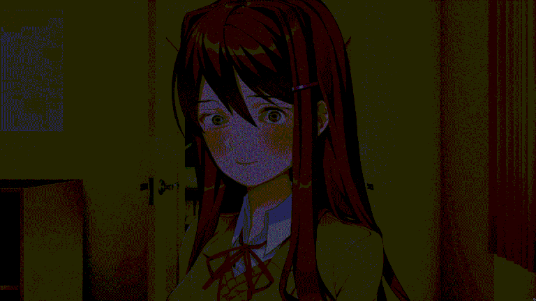

# Yuri eye tracking

If you ever felt safe, you can forget it.

## References

* http://ddlc.moe

If you haven't played yet, welcome and go play it now. It's a nice simple dating sim. You won't regret it... hopefuly.
For extracting assets you can use [unrpa](https://github.com/Lattyware/unrpa).

* https://github.com/Aditya-Khadilkar/Face-tracking-with-Anime-characters

This is the main reference for eye tracking, all other logic & rendering is independant.
The main reason I made this is because the original project does not support variable window size.

## Dependencies

* pygame
* opencv

### Debian

```bash
sudo apt install python3-pygame-sdl2
sudo apt install python3-opencv
```

### Windows

```cmd
pip install pygame-ce
pip install opencv-python
pip install opencv-contrib-python
```

## Usage (Linux)

```bash
git clone https://github.com/slowtimer/yuritrack
cd yuritrack
./yuri.py
```

Hope you like closets.

When any command line argument is provided you will get an alternative setup.

```bash
./yuri.py a
```

> "Do you like it??"
> "I wrote it for you!"
> -- Yuri

For cleaner experience you can redirect cout to null.

```bash
./yuri.py > /dev/null
```

If you wanna be funny you can combine it with `i3lock` and `picom`.

```picom.conf
rules: ({
  match = "class_g = 'i3lock'";
  opacity = 0.25;
  corner-radius = 0;
  blur-background = true;
})
```

Now run yuri.py, set it to fullscreen and run i3lock. Everyone around you will appreciate it.

## Usage (Windows)

```cmd
git clone https://github.com/slowtimer/yuritrack
cd yuritrack
python.exe .\yuri.py
```

Or just download the repo and run it from File Explorer *pleb*.
You will still need the dependencies.


